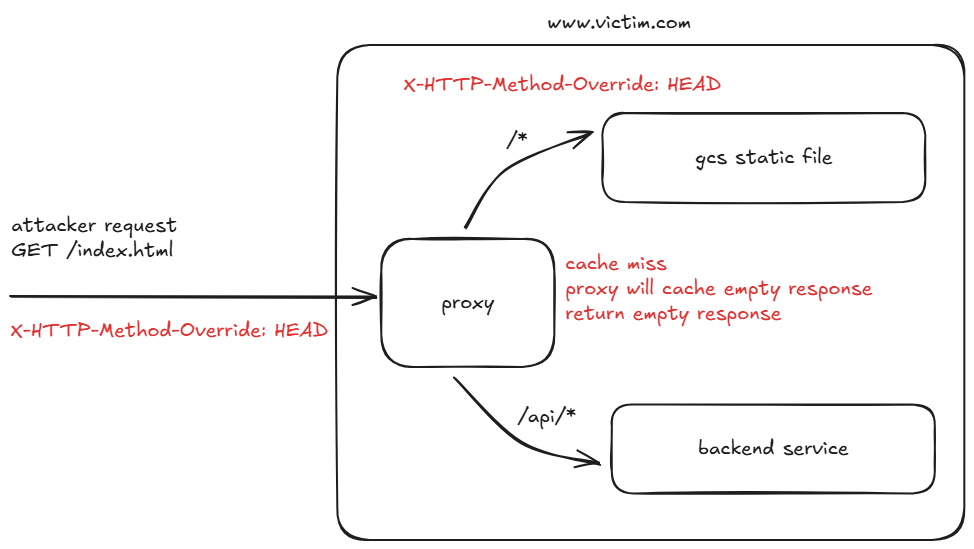
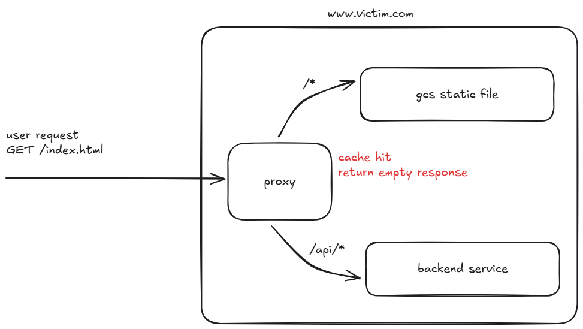

# GCS Cache Poisoning Lab

This lab demonstrates a cache poisoning vulnerability where an Nginx reverse proxy forwarding requests to Google Cloud Storage (GCS) can be tricked into caching an incorrect response using the `X-HTTP-Method-Override` header.

## Vulnerability Details

- **Component**: Nginx Reverse Proxy + GCS Backend.
- **Mechanism**: Nginx typically uses the URL as the cache key. However, GCS respects the `X-HTTP-Method-Override` header to change the HTTP verb (e.g., treating a POST as a GET or vice versa).
- **The Attack**: An attacker sends a `GET` request with `X-HTTP-Method-Override: HEAD`. GCS responds to this as if it were a `HEAD` request (sending headers but no body). Nginx, seeing a standard 200 OK response to a `GET` request, caches this empty body. Subsequent legitimate users requesting the same URL receive the empty cached response, effectively causing a Denial of Service (DoS).
- **Other Variants**: Overriding to `POST` or other methods might yield XML errors or different content which can also be cached to deface or break the site.

## Architecture

- **`nginx-proxy`**: Nginx instance configured to proxy to GCS and cache responses.

## Prerequisites

1. **Google Cloud Storage Bucket**: You need a valid GCS bucket.
2. **Docker & Docker Compose**: To run the lab infrastructure.

## Setup

### 1. Prepare GCS Bucket
1. Create a GCS bucket.
2. Upload the files from `gcs-content/` to the root of your bucket:
   - `index.html`
   - `script.js`
3. Ensure these files are **Publicly Accessible** (add `allUsers` with `Storage Object Viewer` role to the bucket permissions, or make individual objects public).

### 2. Configure the Lab
1. Open `nginx/default.conf`.
2. Find the line:
   ```nginx
   rewrite ^/(.*)$ /REPLACE_WITH_YOUR_BUCKET_NAME/$1 break;
   ```
3. Replace `REPLACE_WITH_YOUR_BUCKET_NAME` with your actual bucket name.

### 3. Run the Lab
```bash
docker-compose up --build
```

- The **Nginx Proxy** will be listening on port `8080`.


## Exploitation Walkthrough

### 1. Verify Baseline
Visit `http://localhost:8080/index.html` in your browser. You should see the content from your GCS bucket.

### 2. Launch Attack
Use `curl` to poison the cache. We will ask GCS to treat our request as a `HEAD` request, but Nginx will cache it as a `GET` response.

```bash
curl -v -H "X-HTTP-Method-Override: HEAD" http://localhost:8080/index.html
```




You should see an empty response body.

### 3. Verify Poisoning
If you visit `http://localhost:8080/index.html` in your browser, you will see a blank page (or the empty body).




### 4. Wait for Cache Expiry
The cache is configured to expire after 1 hour (`proxy_cache_valid 200 60m`). Restarting the nginx container will also clear the cache.

```bash
docker-compose restart nginx-proxy
```
